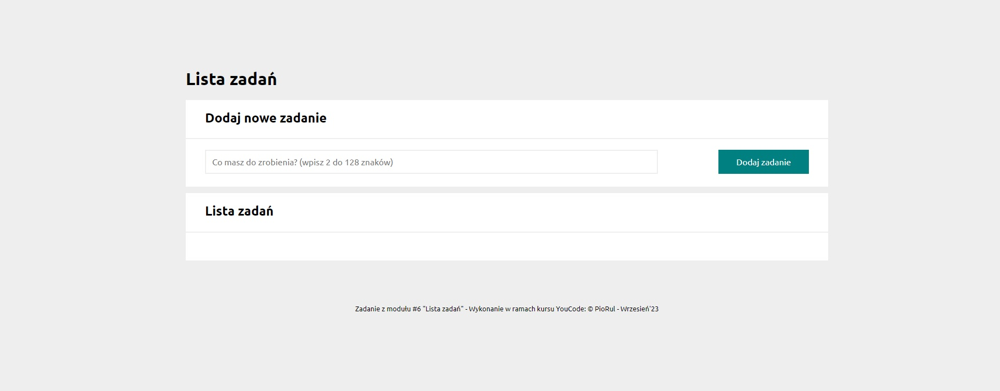
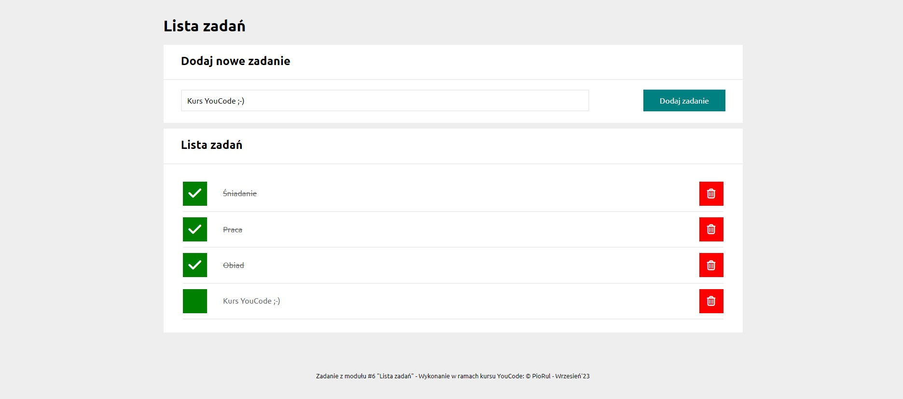

# To Do List

## Description

A simple to do list as continuation of learning HTML, CSS and Javascript. 
The html code includes: the form with a button "submit", fonts from Font Awesome and Google Fonts. 
Applied Flexbox, Grid, Media Query, normalize.css and the BEM convention. 
In Javascript code I used **arrow functions**, **render** and **init** functions, variables **const** and **let**

## How it's working

This task list allows you to add, delete and mark "done" actions to be performed.

## Warning

**After refreshing the page, the list is deleted and cannot be recreated. So be careful ;-)**

## Screenshots

**Screenshot 1:** default apperance, no data entered

**Screenshot 2:** entered data and displayed result

## Demo

https://piotr-rulewicz.github.io/to-do-list/
